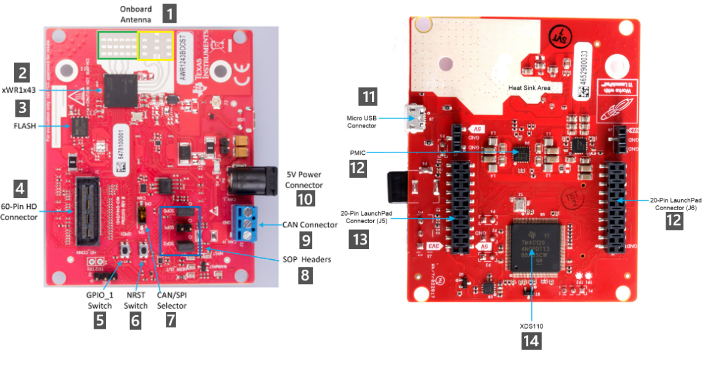
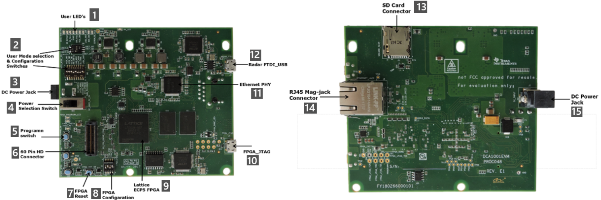
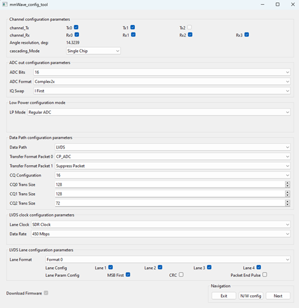
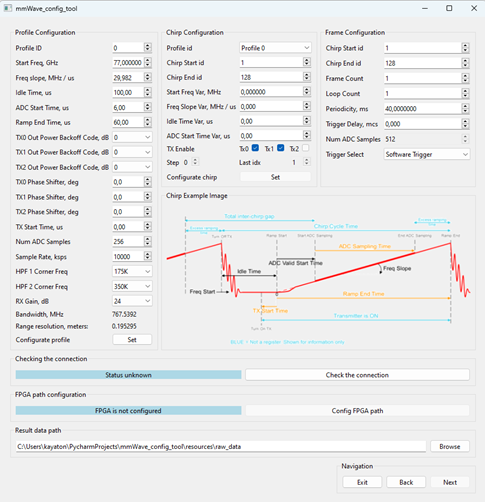
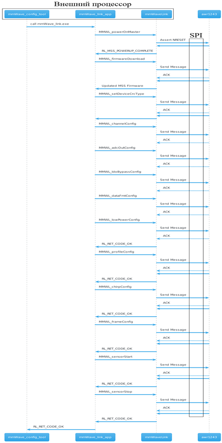
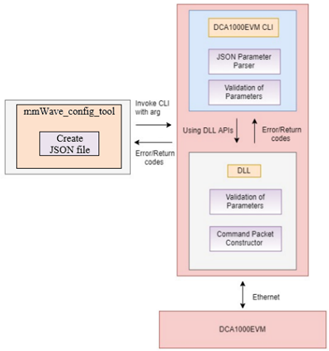
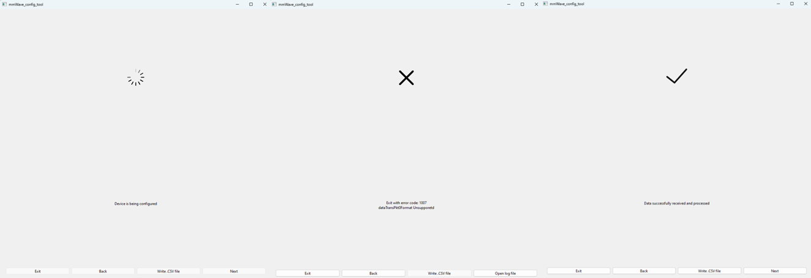
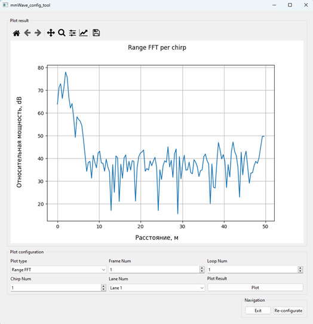

# Инструмент для физического прототипирования различных форм сигнала радара

## Основан на:

### Сенсор AWR1243

### Карта захвата DCA1000EVM

## Процесс конфигурации:
* Скачивание зависимостей и запуск скрипта
* Подключение устройства к ПК
* Конфигурация сетевого адаптера на адрес устройства:
  * Адрес: 192.168.33.30
* Конфигурация формата данных, способа их передачи и режима питания устройства
  * Параметры каналов

      * Кол-во передатчиков сигнала (единовременно могут работать 2 из 3)
      * Кол-во приемников (отраженного) сигнала 
      * Расчетный показатель разрешения по углу 
      * Количество сенсоров. DCA1000EVM позволяет работать только в режиме одного сенсора

    * Формат выходных данных АЦП 
      * Кол-во бит (12/14/16)
      * Формат выходных данных (Real/Complex1x/Complex2x/Pseudo Real)
      * Приоритет вывода мнимой или вещественной части сигнала

    * Режим питания устройства 
      * Постоянное питание АЦП 
      * Низкое потребление
  
    * Конфигурация высокоскоростного канала передачи данных 
      * Интерфейс канала передачи данных (CSI2/LVDS)
      * Форматы вывода данных (выбор содержимого пакета)
      * Размер данных выборок CQ на линиях (12/14/16)
      * Кол-во выборок (в 16-битных полусловах) данных CQ0, CQ1, CQ2 подлежащих передаче. Допустимый диапазон [от 32 до 128 полуслов]
    
    * Конфигурация тактовой частоты канала передачи данных 
      * Метод синхронизации (DDR Clock, SDR Clock)
      * Скорость передачи данных (600 Mbps, 450, 400, 300, 225, 150)

    * Конфигурация линий передачи данных 
      * Формат линий передачи 
        * format0 (RX0, RX1, RX2, RX3)
        * format1 (RX3, RX2, RX1, RX0)
      * Линии передачи данных (по каким линиям приходят данные, соответствует приемникам)
      * Параметры линий передачи данных 
        * MSB - наиболее значимый бит или LSB - наименее значимый бит 
        * CRC - циклический избыточный код (для валидации целостности)
      
    * Загрузка прошивки для DCA1000EVM (рекомендуется всегда загружать)
    * Навигация 
      * Выход из приложения 
      * Настройка параметров сетевого адаптера (открытие окна панели управления Windows)
      * Следующий этап конфигурации

* Конфигурация параметров сигнала
  * Конфигурация профиля 
    * ID профиля (всего возможно 4 разных профиля)
    * Начальная частота для каждого профиля (для сенсоров с частотой = 77 ГГц рабочая частота: 76-81 ГГц)
    * Наклон подъема 
    * Время простоя 
    * Время начала захвата АЦП 
    * Время окончания подъема 
    * Отключение выходной мощности для TX0, TX1, TX2 
      * Это поле определяет, насколько следует уменьшить мощность передачи по сравнению с максимальной 
      * Для наилучшего согласования между каналами TX следует использовать один и тот же профиль сигнала и одинаковое значение выходной мощности TX для всех каналов TX, которые используются при формировании луча 
    * Дополнительный фазовый сдвиг на выходе TX0/1/2 
    * Время запуска передатчика 
    * Количество выборок АЦП для захвата в сигнале для каждого приемника 
    * Частота дискретизации АЦП для каждого профиля 
    * Угловая частота HPF1/HPF2 (high pass filter)
    * Чувствительность приемника (RxGain)
    * Расчетный показатель полосы пропускания 
    * Расчетный показатель разрешения по дальности 
    * Кнопка создания профиля 
  * Конфигурация сигнала 
    * ID профиля 
    * ID начального сигнала (всего возможно 512 разнообразных дополнительных параметров сигнала)
    * ID конечного сигнала 
    * Частота запуска рампы (для сенсоров с частотой = 77Ghz рабочая частота: 76-81GHz)
    * Наклон подъема 
    * Время простоя для каждого сигнала 
    * Время запуска АЦП для каждого сигнала 
    * Конфигурация передатчика (или передатчиков), который будет испускать заданный сигнал 
    * Шаг, с которым будут задаваться сигналы (активируется, если начальный и конечный индекс сигнала равны)
    * Количество сигналов, которые будут настроены с данным шагом 
    * Кнопка создания сигнала 
  * Конфигурация кадра 
    * Начальный индекс сигнала, допустимый диапазон: = от 0 до 511 
    * Конечный индекс сигнала, допустимый диапазон: = от 0 до 511 
    * Количество передаваемых кадров. Допустимый диапазон от 0 до 65535 
    * Количество повторений от chirp Start id до chirp Start id в каждом кадре, допустимый диапазон = от 1 до 255 
    * Период повторения кадра:
      * Период >= Суммарное время всех сигналов + межкадровое время 
      * Суммарное время всех сигналов = Количество циклов * Количество сигналов * Период сигнала 
    * Временная задержка от запуска до появления сигналов кадра 
    * Количество отсчетов АЦП для захвата, соответствует конфигурации профиля 
    * Выбор режима для запуска начала передачи кадра (программный или аппаратный)
  * Проверка подключения устройства 
    * Отправка проверочного пакета на порт устройства 
  * Конфигурация параметров устройства 
    * Отправка пакета с информацией о максимальном объеме данных и максимальном кол-ве кадров 
  * Навигация 
    * Выход из приложения 
    * Переход к предыдущему этапу 
    * Переход к этапу конфигурации и запуска устройства
  

## Взаимодействие с устройством:
* За взаимодействие с устройством отвечают два исполняемых файла:
  * mmWave_link.exe - отправляет заданные параметры, инициализирует, запускает и останавливает устройство
  
  

  * DCA1000EVM_CLI_Control.exe - прослушивает порт устройства и записывает данные, дает возможность запускать в режиме бесконечной записи, сбрасывает и проверяет подключение DCA1000EVM
  
  

* Процесс конфигурации и запуска устройства:

## Обработка полученных данных
* Доступны следующие алгоритмы обработки данных:
  * Range FFT 
  * Doppler FFT 
  * Angle FFT 
  * Time Domain 
  * CA-CFAR 
  * Detected object

## TODO:
* Возможность обрабатывать ранее полученные данные
* Упрощение взаимодействия пользователя с UI 
* Создание видео из полученных кадров 
* Интеграция нейронных сетей для определения объектов
